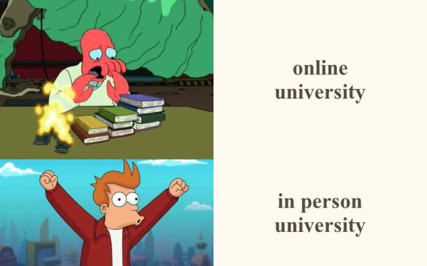

# Hello!
Welcome to my page. 

## My meme


I made this meme because:
* I am not a fan of doing uni online
* I found these images and thought that they were a good fit

### CODE
```
library(magick)

dr_zoidberg <- image_read("https://oyster.ignimgs.com/mediawiki/apis.ign.com/futurama/4/4b/Slinky.jpg") %>%
  image_scale(400)

fry <- image_read("https://static3.srcdn.com/wordpress/wp-content/uploads/2019/12/tv-6-futurama-Cropped.jpg?q=50&fit=crop&w=963&h=481&dpr=1.5") %>%
  image_scale(400)

zoidberg_text <- image_blank(width = 400,
                             height = 299,
                             color = "#fffaef") %>%
  image_annotate(text = "online\nuniversity",
                 color = "#554a42",
                 size = 40,
                 font = "Times New Roman",
                 weight = 700,
                 gravity = "center")

fry_text <- image_blank(width = 400,
                        height = 200,
                        color = "#fffaef") %>%
  image_annotate(text = "in person\nuniversity",
                 color = "#554a42",
                 size = 40,
                 font = "Times New Roman",
                 weight = 700,
                 gravity = "center")

first_row <- c(dr_zoidberg, zoidberg_text) %>%
  image_append()

second_row <- c(fry, fry_text) %>%
  image_append()

meme1 <- c(first_row, second_row) %>%
  image_append(stack = TRUE) %>%
  image_scale(700)
  
image_write(meme1,"meme1.png")
```
